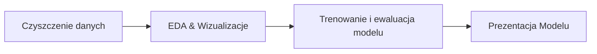

<h1 align="center">Customer Churn Prediction</h1>

Projekt koncentruje się na przewidywaniu odejścia klienta (churn) przy użyciu technik nadzorowanego uczenia maszynowego. W oparciu o zbiór danych IBM Telco Customer Churn przetestowano kilka modeli klasyfikacyjnych — w tym ***Regresję Logistyczną***, ***Random Forest*** oraz ***XGBoost***. Ostatecznie wybrano Regresję Logistyczną ze względu na najlepsze wyniki w metrykach oceny.

Cały projekt został zrealizowany w środowisku ***Azure Machine Learning*** z wykorzystaniem notebooków Jupyter, co umożliwiło sprawne eksperymentowanie i śledzenie wyników modeli.

Aby umożliwić użytkownikowi wygodną interakcję z modelem, przygotowano aplikację internetową w ***Streamlit***. Demo pozwala użytkownikowi wprowadzić dane klienta i uzyskać predykcję odejścia wraz z prawdopodobieństwem. Aplikacja oferuje również tryb debugowania oraz widok wpływu cech (feature impact), dostarczając dodatkowych informacji o działaniu modelu.

🇬🇧 English version of the document can be found [here](/README.md) / Polską wersję dokumentu można znaleźć [tutaj](/README.md). 🇬🇧

## Zawartość
- [Demo](#demo)
- [Funkcje](#funkcje)
- [Etapy Projektu](#etapy-projektu)
- [Technologie](#technologie)

## Demo
Wersje demonstracyjna aplikacji przewidującej rezygnację z usług przez klienta jest dostępna [TUTAJ](https://gbchurnprediction.streamlit.app/).

Aplikacja została zbudowana w środowisku Streamlit i umożliwia użytkownikowi:

- Wprowadzenie danych klienta i otrzymanie predykcji odejścia.
- Podgląd prawdopodobieństwa odejścia w formie procentowej.
- Włączenie trybu debugowania (Debug Mode), aby sprawdzić, jak dane wejściowe są przekształcane przed predykcją.
- Włączenie widoku wpływu cech (Feature Impact), aby zobaczyć współczynniki modelu oraz względne znaczenie poszczególnych zmiennych.

Poniżej przedstawiono kilka zrzutów ekranu z aplikacji:

**Główny interfejs:**

**Rozwijany pasek boczny:**

**Wynik predykcji:**

## Funkcje
Kluczowe elementy interfejsu aplikacji to:

- Formularz do wprowadzania danych klienta
- Predykcja prawdopodobieństwa odejścia w czasie rzeczywistym
- Tryb debugowania do sprawdzania przetwarzanych cech
- Panel z informacjami o wpływie poszczególnych cech
- Interaktywny interfejs użytkownika oparty na Streamlit

## Etapy projektu

## Technologie
Najważniejsze technologie wykorzystane w projekcie:
- **Środowisko pracy:** *Azure, Jupyter Notebooks*
- **Czyszczenie danych:** *Pandas, NumPy*
- **EDA & Wizualizacje:** *Matplotlib, Seaborn, Plotly*
- **Trenowanie i ewaluacja modelu:** *Scikit-learn, XGBoost, Joblib*
- **Prezentacja Modelu:** *Streamlit*