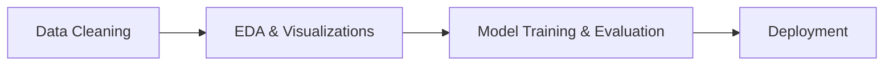
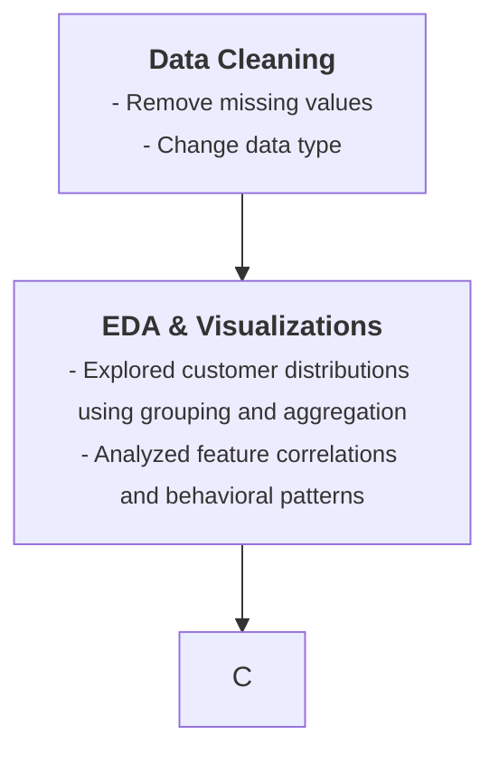

# Customer Churn Prediction
Machine Learning Project in progress

## Contents
- [Demo](#demo)
- [Features](#features)
- [Workflow](#workflow)
- [Technologies](#technologies)

## Demo

## Features

## Workflow

## Technologies

