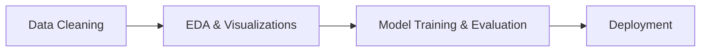

# Customer Churn Prediction
Machine Learning Project in progress

## Contents
- [Demo](#demo)
- [Features](#features)
- [Workflow](#workflow)
- [Technologies](#technologies)

## Demo

## Features

- Input form for customer details
- Real-time churn probability prediction
- Debug mode to inspect feature preprocessing
- Feature insights panel
- Streamlit-based interactive UI

## Workflow

## Technologies

- **Environment:** *Azure, Jupyter Notebooks*
- **Data Cleaning:** *Pandas, NumPy*
- **EDA & Visualizations:** *Matplotlib, Seaborn, Plotly*
- **Model Training & Evaluation:** *Scikit-learn, XGBoost, Joblib*
- **Deployment:** *Streamlit*