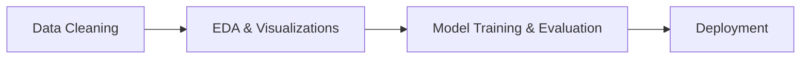

# Customer Churn Prediction
This project focuses on predicting customer churn using supervised machine learning techniques. Based on the IBM Telco Customer Churn dataset, several classification models were tested — including ***Logistic Regression***, ***Random Forest***, and ***XGBoost***. Logistic Regression was selected as the final model due to its superior performance on evaluation metrics.

The entire project was developed in the ***Azure Machine Learning*** environment using Jupyter notebooks, allowing for efficient experimentation and model tracking.

To make the solution interactive and user-friendly, a ***Streamlit*** web application was developed. The demo allows users to input customer data and receive churn predictions along with the probability score. The application also includes a debug mode and a feature impact view, offering additional insights into model behavior.

## Contents
- [Demo](#demo)
- [Features](#features)
- [Workflow](#workflow)
- [Technologies](#technologies)

## Demo
A live demo of the churn prediction app is available [HERE](https://gbchurnprediction.streamlit.app/).

The app is built with Streamlit and allows users to:

- Input customer data and receive a churn prediction.
- View the churn probability as a percentage.
- Enable Debug Mode to inspect how features are transformed before prediction.
- Enable Feature Impact to view model coefficients and the relative influence of each feature.

Below are some screenshots from the application:

**Main Interface:**

**Sidebar with Options:**

**Prediction Output:**

## Features

- Input form for customer details
- Real-time churn probability prediction
- Debug mode to inspect feature preprocessing
- Feature insights panel
- Streamlit-based interactive UI

## Workflow

## Technologies

- **Environment:** *Azure, Jupyter Notebooks*
- **Data Cleaning:** *Pandas, NumPy*
- **EDA & Visualizations:** *Matplotlib, Seaborn, Plotly*
- **Model Training & Evaluation:** *Scikit-learn, XGBoost, Joblib*
- **Deployment:** *Streamlit*